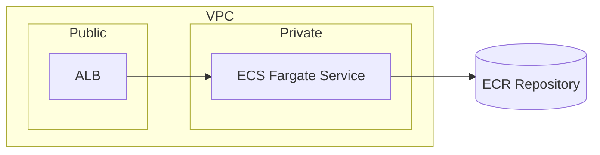

# Provision Demo AWS ECS Fargate Environment for Corporate Website (Dev)

## 1. Context
Manager request (urgent): Stand up a minimal, automated AWS environment for the corporate website demo. Deadline end of current week. Single dev environment only.

## 2. Problem Statement
No existing reproducible AWS environment (network + compute + registry) to host demo site and validate CI/CD integration.

## 3. Business Value / Impact
- Enables infra automation validation
- Provides baseline for later production hardening
- Reduces manual setup risk
- Establishes repeatable tagging & structure

## 4. Scope (Included)
- Region us-east-1
- VPC 10.0.0.0/16 (AZs: us-east-1a / us-east-1b)
- Public subnets 10.0.1.0/24, 10.0.2.0/24 (ALB)
- Private subnets 10.0.3.0/24, 10.0.4.0/24 (ECS tasks)
- IGW + public route tables; private route tables
- ALB HTTP :80 (SG ingress 0.0.0.0/0)
- ECS Fargate cluster + 1 service (desired count=1)
- Task definition (0.25 vCPU / 512Mi proposed)
- New ECR repo (tag: latest)
- CloudWatch Logs (single group)
- Terraform (no modules) + variables
- Remote state: existing S3 bucket cloud-infrastructure-tfstate-prod (eu-central-1)
 - Standard tags: Environment=dev, Project=corp-website-demo, Owner=platform-team, CostCenter=CC-1001, SecurityOwner=sec-ops-team

### Out of Scope
TLS, custom domain, WAF, CDN, autoscaling, alarms, tracing, dashboards, persistence, backups, DR, security scanning, promotion flow.

## 5. Functional Requirements
- FR-1 Network objects created per CIDR & AZ spec
- FR-2 ALB reachable via AWS DNS on HTTP 200 / path
- FR-3 ECR repo provisioned; supports latest image tag
- FR-4 ECS service runs exactly 1 task after apply
- FR-5 Target group health check path / (confirmed)
- FR-6 Output ALB DNS name on apply
- FR-7 Remote S3 state used
- FR-8 Tags applied uniformly (using sample tag set provided)
- FR-9 Output ECS service name as terraform output variable for CI consumption

## 6. Non-Functional / DevOps Aspects
Observability minimal; security intentionally open; manual scaling; cost basic on-demand; no compliance.

## 7. Architecture / Technical Notes

Proposed Terraform files: main.tf, network.tf, ecs.tf, alb.tf, ecr.tf, variables.tf, outputs.tf.

## 8. Data / Config Changes
| Type | Description | Migration | Rollback |
|------|-------------|-----------|----------|
| Terraform State | Remote backend use | None | Remove workspace state |
| ECR Repo | New registry | None | Delete repo manually |
| ECS Service | New service/task | None | terraform destroy |

## 9. CI/CD Considerations
Manual dispatch workflow; separate manual plan & apply stages; sequential; artifact output ALB DNS; skip lint.

## 10. Acceptance Criteria
- Plan runs without errors and lists expected resources
- Apply completes and ALB DNS responds 200 on /
- ECS service shows 1 RUNNING task
- CloudWatch log group receives task stdout
- All created resources include required tags (Environment=dev, Project=corp-website-demo, Owner=platform-team, CostCenter=CC-1001, SecurityOwner=sec-ops-team)
- Terraform outputs include alb_dns_name and ecs_service_name

## 11. Definition of Done
- [ ] AC validated
- [ ] Terraform code committed
- [ ] Remote state operational
- [ ] ALB DNS captured in CI artifact or comment
- [ ] Tags verified
- [ ] Plan + apply both executed manually

## 12. Risks & Mitigations
| Risk | Likelihood | Impact | Mitigation |
|------|------------|--------|-----------|
| Open ingress | High | Medium | Document demo scope; tighten later |
| No TLS | High | Low | Mark non-prod usage |
| Single task | High | Medium | Enable scaling later |
| State bucket region differs | Medium | Low | Accept; unify later |
| No scanning | High | Low | Add ECR scan Phase 2 |

## 13. Dependencies
AWS credentials, existing S3 backend, initial container image.

## 14. OPEN QUESTIONS
None. All previously listed questions have been answered with sample values:
- Tags: Project=corp-website-demo, Owner=platform-team, CostCenter=CC-1001, SecurityOwner=sec-ops-team
- Health check path: /
- Task size: 0.25 vCPU / 512Mi
- Terraform workspace: dev (use separate workspace named "dev")
- Output variable for ECS service name: Yes (ecs_service_name)
If any sample value must change, update tags and outputs accordingly before production hardening.

## 15. Additional Notes
Phase 2 roadmap: TLS, ingress lockdown, autoscaling, alarms, scanning, DR.

## Jira Payload (Reference)
```
POST $JIRA_API_URL/rest/api/3/issue
Authorization: Basic (email:token)
Content-Type: application/json
```
```json
{
  "fields": {
    "project": { "key": "{{JIRA_API_PROJECT_KEY}}" },
  "summary": "Provision Demo AWS ECS Fargate Environment (Dev)",
    "issuetype": { "name": "Task" },
    "description": {
      "type": "doc",
      "version": 1,
      "content": [
        {"type": "paragraph", "content": [{"text": "See markdown in repo docs/jira/provision-demo-ecs-fargate-dev.md", "type": "text"}]}
      ]
    },
  "labels": ["infra","aws","ecs","demo","dev"],
  "customfield_tags": "Environment=dev;Project=corp-website-demo;Owner=platform-team;CostCenter=CC-1001;SecurityOwner=sec-ops-team",
    "customfield_{{estimate_field}}": null
  }
}
```

## Curl Example
```
curl -X POST --http1.1 \
  -u "$JIRA_EMAIL:$JIRA_API_TOKEN" \
  -H "Content-Type: application/json" \
  -d @jira_issue.json \
  "$JIRA_API_URL/rest/api/3/issue"
```

## Variable Checklist
- JIRA_API_PROJECT_KEY
- project_name
- owner
- cost_center
- security_owner
``